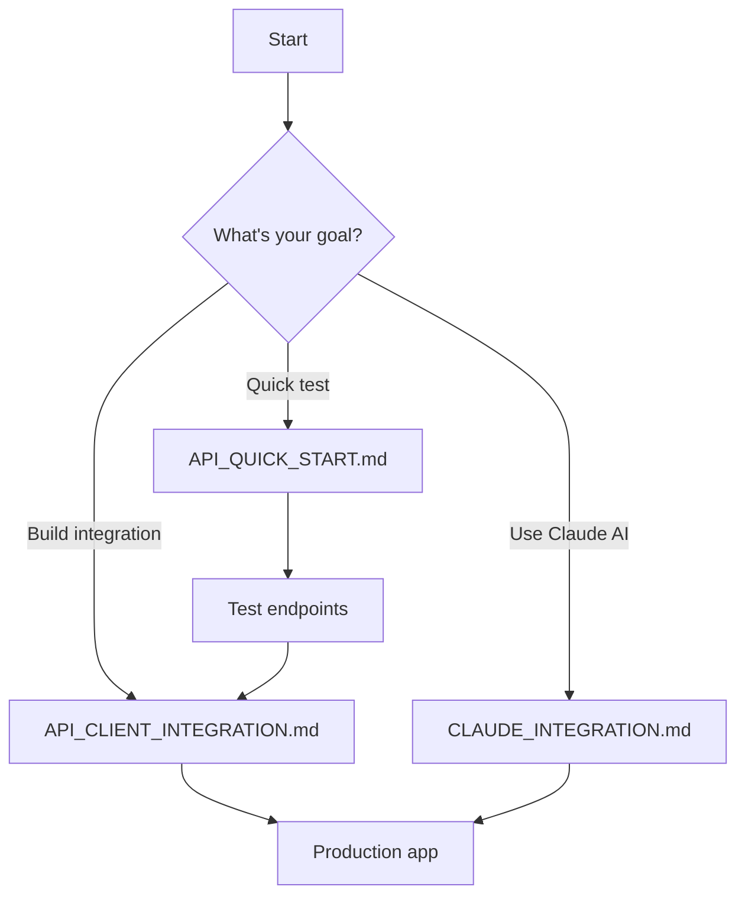

# be-invest API Documentation Guide

**Last Updated:** December 6, 2025

This guide helps you find the right documentation for your needs.

---

## 📚 Documentation Overview

We have multiple API documentation files tailored for different use cases:

| Document | Purpose | Best For |
|----------|---------|----------|
| **[API_CLIENT_INTEGRATION.md](API_CLIENT_INTEGRATION.md)** | Complete client integration guide | Developers building apps/integrations |
| **[API_QUICK_START.md](API_QUICK_START.md)** | 5-minute quick start | Getting started quickly |
| **[API_REFERENCE.md](API_REFERENCE.md)** | Complete API reference | Looking up endpoint details |
| **[API_INTEGRATION.md](API_INTEGRATION.md)** | Simple integration examples | Quick code snippets |
| **[CLAUDE_INTEGRATION.md](CLAUDE_INTEGRATION.md)** | Claude AI model integration | Using Anthropic models |

---

## 🎯 Choose Your Path

### I'm a Developer Building an Integration

**👉 Start here:** [API_CLIENT_INTEGRATION.md](API_CLIENT_INTEGRATION.md)

**What you'll find:**
- Complete endpoint documentation with examples
- Full Python and TypeScript client classes
- Error handling patterns
- Rate limiting guidance
- Best practices for production use
- Caching strategies
- Async operation examples

**Languages covered:**
- Python (with complete client class)
- TypeScript/JavaScript (with type definitions)
- cURL
- PowerShell

---

### I Just Want to Get Started Quickly

**👉 Start here:** [API_QUICK_START.md](API_QUICK_START.md)

**What you'll find:**
- Simple 5-minute setup
- Basic usage examples
- Test commands
- Interactive API documentation link

**Then move to:**
- [API_CLIENT_INTEGRATION.md](API_CLIENT_INTEGRATION.md) for production code

---

### I Need to Look Up an Endpoint

**👉 Start here:** [API_REFERENCE.md](API_REFERENCE.md)

**What you'll find:**
- All endpoints listed
- Request/response formats
- Status codes
- Quick examples

---

### I Need Simple Code Snippets

**👉 Start here:** [API_INTEGRATION.md](API_INTEGRATION.md)

**What you'll find:**
- Short, copy-paste code examples
- Python, JavaScript, and Shell examples
- Minimal explanations

---

### I Want to Use Claude (Anthropic) Models

**👉 Start here:** [CLAUDE_INTEGRATION.md](CLAUDE_INTEGRATION.md)

**What you'll find:**
- How to set up Anthropic API keys
- Model selection guide
- Claude-specific examples
- Rate limits and best practices
- Troubleshooting Claude integration

---

## 🔄 Typical Developer Journey



### Recommended Order:

1. **Start:** [API_QUICK_START.md](API_QUICK_START.md) (5 minutes)
   - Get server running
   - Test basic endpoints
   - View interactive docs

2. **Understand:** [API_CLIENT_INTEGRATION.md](API_CLIENT_INTEGRATION.md) (30 minutes)
   - Read endpoint documentation
   - Copy client class for your language
   - Implement error handling
   - Add caching

3. **Optimize:** [CLAUDE_INTEGRATION.md](CLAUDE_INTEGRATION.md) (if using AI models)
   - Set up Claude API
   - Choose best model
   - Implement retry logic

4. **Reference:** [API_REFERENCE.md](API_REFERENCE.md) (as needed)
   - Look up specific endpoints
   - Check response formats

---

## 📋 Complete Endpoint List

Quick reference of all available endpoints:

| Endpoint | Method | Purpose |
|----------|--------|---------|
| `/health` | GET | Server health check |
| `/cost-analysis` | GET | Get all broker analyses |
| `/cost-analysis/{broker}` | GET | Get specific broker |
| `/cost-comparison-tables` | GET | Generate comparison tables (LLM) |
| `/brokers` | GET | List all brokers |
| `/summary` | GET | Get markdown summary |
| `/refresh-pdfs` | POST | Download and extract PDFs |
| `/refresh-and-analyze` | POST | Full refresh + LLM analysis |

**Details for each endpoint:** See [API_CLIENT_INTEGRATION.md](API_CLIENT_INTEGRATION.md)

---

## 🛠️ Quick Integration Examples

### Python
```python
from be_invest_client import BeInvestClient  # See API_CLIENT_INTEGRATION.md

client = BeInvestClient("http://localhost:8000")
tables = client.get_comparison_tables(model="claude-sonnet-4-20250514")
print(f"Found {len(tables['etfs'])} brokers")
```

### JavaScript/TypeScript
```typescript
import { BeInvestClient } from './be-invest-client';  // See API_CLIENT_INTEGRATION.md

const client = new BeInvestClient("http://localhost:8000");
const tables = await client.getComparisonTables("claude-sonnet-4-20250514");
console.log(`Found ${tables.etfs.length} brokers`);
```

### cURL
```bash
curl "http://localhost:8000/cost-comparison-tables?model=claude-sonnet-4-20250514"
```

**Full client implementation:** [API_CLIENT_INTEGRATION.md](API_CLIENT_INTEGRATION.md)

---

## 🔑 API Key Setup

If using LLM-powered endpoints (`/cost-comparison-tables`, `/refresh-and-analyze`):

**OpenAI (GPT models):**
```powershell
$env:OPENAI_API_KEY = "sk-..."
```

**Anthropic (Claude models):**
```powershell
$env:ANTHROPIC_API_KEY = "sk-ant-api03-..."
```

**Details:** See [CLAUDE_INTEGRATION.md](CLAUDE_INTEGRATION.md)

---

## ❓ FAQ

### Which document should I read first?

- **Developer:** [API_CLIENT_INTEGRATION.md](API_CLIENT_INTEGRATION.md)
- **Quick test:** [API_QUICK_START.md](API_QUICK_START.md)
- **Using Claude:** [CLAUDE_INTEGRATION.md](CLAUDE_INTEGRATION.md)

### Where are the complete code examples?

[API_CLIENT_INTEGRATION.md](API_CLIENT_INTEGRATION.md) has full client classes for Python and TypeScript.

### How do I use Claude instead of GPT?

See [CLAUDE_INTEGRATION.md](CLAUDE_INTEGRATION.md) for complete Claude setup and usage.

### Where's the endpoint reference?

Quick version: [API_REFERENCE.md](API_REFERENCE.md)  
Complete version: [API_CLIENT_INTEGRATION.md](API_CLIENT_INTEGRATION.md)

### Can I see the interactive API docs?

Yes! Start the server and visit: http://localhost:8000/docs

### Which model should I use?

- **Most accurate (recommended):** `claude-sonnet-4-20250514`
- **Fast & good:** `gpt-4o`
- **Details:** [CLAUDE_INTEGRATION.md](CLAUDE_INTEGRATION.md#model-selection)

---

## 📞 Support

- **Issues:** Check troubleshooting sections in respective documents
- **Questions:** See FAQ sections in each document
- **API Errors:** [API_CLIENT_INTEGRATION.md - Error Handling](API_CLIENT_INTEGRATION.md#error-handling)

---

## 🔄 Keep Updated

This documentation is actively maintained. Check the "Last Updated" date at the top of each document.

**Latest features:**
- Claude (Anthropic) integration ✅
- Cost comparison tables ✅
- Full refresh + analyze endpoint ✅
- CORS support ✅

---

**Quick Links:**
- 🚀 [Quick Start](API_QUICK_START.md)
- 💻 [Client Integration](API_CLIENT_INTEGRATION.md)
- 🤖 [Claude Integration](CLAUDE_INTEGRATION.md)
- 📖 [API Reference](API_REFERENCE.md)

