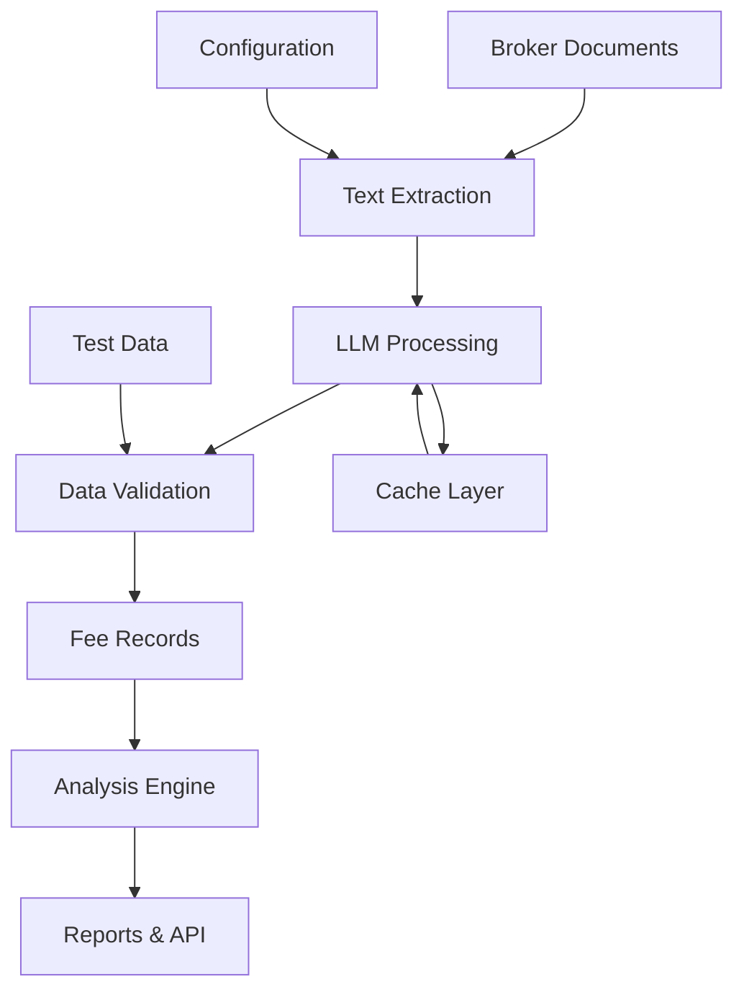

# Development Guide

> Complete guide for contributing to and developing the BE-Invest project.

## Table of Contents

- [Development Setup](#development-setup)
- [Architecture Overview](#architecture-overview)
- [Code Organization](#code-organization)
- [Development Workflow](#development-workflow)
- [Testing Strategy](#testing-strategy)
- [Code Style and Standards](#code-style-and-standards)
- [Adding New Features](#adding-new-features)
- [Debugging and Troubleshooting](#debugging-and-troubleshooting)

## Development Setup

### Prerequisites

- **Python**: 3.9 or higher
- **Git**: For version control
- **API Keys**: OpenAI or Anthropic for LLM features
- **IDE**: VS Code, PyCharm, or similar

### Initial Setup

```bash
# Clone the repository
git clone https://github.com/your-username/be-invest.git
cd be-invest

# Create virtual environment
python -m venv venv
source venv/bin/activate  # On Windows: venv\Scripts\activate

# Install in development mode
pip install -e ".[dev]"

# Set up pre-commit hooks
pre-commit install

# Create environment file
cp .env.example .env
# Edit .env with your API keys
```

### Environment Configuration

Create a `.env` file in the project root:

```env
# LLM API Keys (choose one or both)
OPENAI_API_KEY=your-openai-key-here
ANTHROPIC_API_KEY=your-anthropic-key-here

# Development settings
DEBUG=true
LOG_LEVEL=INFO
CACHE_DIR=data/cache

# API Configuration
API_HOST=localhost
API_PORT=8000
```

### IDE Setup

#### VS Code Configuration

Create `.vscode/settings.json`:

```json
{
  "python.defaultInterpreterPath": "./venv/bin/python",
  "python.linting.enabled": true,
  "python.linting.pylintEnabled": false,
  "python.linting.flake8Enabled": true,
  "python.formatting.provider": "black",
  "python.testing.pytestEnabled": true,
  "python.testing.pytestArgs": ["tests/"],
  "files.exclude": {
    "**/__pycache__": true,
    "**/*.pyc": true,
    ".pytest_cache": true
  }
}
```

Create `.vscode/launch.json` for debugging:

```json
{
  "version": "0.2.0",
  "configurations": [
    {
      "name": "Start API Server",
      "type": "python",
      "request": "launch",
      "program": "-m",
      "args": ["uvicorn", "be_invest.api.server:app", "--reload"],
      "console": "integratedTerminal",
      "cwd": "${workspaceFolder}",
      "env": {
        "PYTHONPATH": "${workspaceFolder}/src"
      }
    },
    {
      "name": "Run Analysis",
      "type": "python",
      "request": "launch",
      "program": "scripts/analyze_broker_fees.py",
      "console": "integratedTerminal",
      "cwd": "${workspaceFolder}"
    }
  ]
}
```

## Architecture Overview

### Core Components

```
be-invest/
├── src/be_invest/           # Core library code
│   ├── models.py           # Pydantic data models
│   ├── cache.py            # Caching infrastructure
│   ├── sources/            # Data extraction modules
│   └── api/                # FastAPI web service
├── scripts/                # Analysis and utility scripts
├── tests/                  # Test suite
├── data/                   # Configuration and outputs
└── docs/                   # Documentation
```

### Data Flow



### Key Abstractions

#### Models (`src/be_invest/models.py`)

```python
@dataclass(frozen=True)
class Broker:
    """Represents a broker with data sources and capabilities."""
    name: str
    website: str
    country: str
    instruments: List[str]
    data_sources: List[DataSource]

@dataclass(frozen=True) 
class FeeRecord:
    """Normalized fee information for analysis."""
    broker: str
    instrument_type: str
    base_fee: Optional[float]
    variable_fee: Optional[str]
    currency: str
```

#### Data Sources (`src/be_invest/sources/`)

- **`llm_extract.py`**: LLM-powered extraction from documents
- **`pdf_extract.py`**: Text extraction from PDF files
- **`manual.py`**: Manual data import from CSV files

#### Cache System (`src/be_invest/cache.py`)

Intelligent caching to minimize API costs and improve performance.

```python
cache = SimpleCache(Path("data/cache"), ttl_seconds=3600)
result = cache.get_or_compute(key, expensive_function, *args)
```

## Code Organization

### Package Structure

```
src/be_invest/
├── __init__.py             # Package initialization
├── models.py               # Data models and types
├── cache.py                # Caching infrastructure
├── sources/                # Data extraction modules
│   ├── __init__.py
│   ├── llm_extract.py      # LLM-powered extraction
│   ├── pdf_extract.py      # PDF text extraction  
│   └── manual.py           # Manual data import
└── api/                    # FastAPI web service
    ├── __init__.py
    ├── server.py           # Main FastAPI app
    ├── routes.py           # API route definitions
    └── models.py           # API-specific models
```

### Naming Conventions

- **Files**: `snake_case.py`
- **Classes**: `PascalCase`
- **Functions/Variables**: `snake_case`
- **Constants**: `UPPER_SNAKE_CASE`
- **Private members**: `_leading_underscore`

### Import Organization

```python
"""Module docstring describing purpose."""
from __future__ import annotations

# Standard library imports
import os
import json
from pathlib import Path
from typing import List, Optional

# Third-party imports
import requests
from pydantic import BaseModel

# Local imports
from ..models import FeeRecord
from ..cache import SimpleCache
```

## Development Workflow

### Feature Development Process

1. **Create Feature Branch**
   ```bash
   git checkout -b feature/new-broker-support
   ```

2. **Implement Changes**
   - Add tests first (TDD approach)
   - Implement functionality
   - Update documentation

3. **Run Quality Checks**
   ```bash
   # Run tests
   python -m pytest tests/ -v
   
   # Check code style
   black --check src/ tests/ scripts/
   flake8 src/ tests/ scripts/
   
   # Type checking
   mypy src/
   ```

4. **Commit and Push**
   ```bash
   git add .
   git commit -m "feat: add support for new broker XYZ"
   git push origin feature/new-broker-support
   ```

5. **Create Pull Request**
   - Use clear, descriptive title
   - Include test results
   - Update documentation
   - Request review

### Branch Strategy

- **`main`**: Production-ready code
- **`develop`**: Integration branch for features
- **`feature/*`**: Individual feature development
- **`hotfix/*`**: Critical bug fixes
- **`release/*`**: Release preparation

### Commit Messages

Follow conventional commit format:

```
type(scope): description

[optional body]

[optional footer]
```

Types:
- `feat`: New feature
- `fix`: Bug fix
- `docs`: Documentation
- `test`: Testing
- `refactor`: Code refactoring
- `perf`: Performance improvement
- `chore`: Maintenance tasks

Examples:
```
feat(llm): add support for Claude 3.5 Sonnet
fix(api): handle missing broker data gracefully
docs(readme): update installation instructions
test(validation): add comprehensive broker fee tests
```

## Testing Strategy

### Test Organization

```
tests/
├── __init__.py
├── test_models.py                      # Unit tests for data models
├── test_cache.py                       # Cache system tests
├── test_llm_extraction.py             # LLM extraction tests
├── test_data_quality_validation.py    # Data quality tests
├── test_api_integration.py            # API integration tests
└── fixtures/                          # Test data and fixtures
    ├── broker_documents/
    └── expected_results/
```

### Test Categories

#### Unit Tests
Test individual components in isolation.

```python
def test_fee_record_creation():
    """Test FeeRecord model validation."""
    record = FeeRecord(
        broker="Test Broker",
        instrument_type="ETFs",
        base_fee=10.0,
        variable_fee=None,
        currency="EUR",
        source="test"
    )
    assert record.broker == "Test Broker"
    assert record.base_fee == 10.0
```

#### Integration Tests
Test component interactions.

```python
def test_llm_extraction_pipeline():
    """Test end-to-end LLM extraction process."""
    extractor = LLMExtractor(api_key="test-key")
    records = extractor.extract_fees(test_document, "Test Broker")
    assert len(records) > 0
    assert all(r.broker == "Test Broker" for r in records)
```

#### Validation Tests
Test against real broker data.

```python
def test_broker_fee_validation():
    """Validate extracted fees against expected values."""
    expected = get_expected_fees("Bolero")
    actual = extract_fees_for_broker("Bolero")
    
    for exp in expected:
        act = find_matching_record(actual, exp)
        assert act is not None, f"Missing fee record for {exp}"
        assert abs(act.base_fee - exp.base_fee) < 0.01
```

### Running Tests

```bash
# Run all tests
python -m pytest tests/ -v

# Run specific test file
python -m pytest tests/test_llm_extraction.py -v

# Run with coverage
python -m pytest tests/ --cov=src/be_invest --cov-report=html

# Run only fast tests (skip LLM calls)
python -m pytest tests/ -m "not slow"

# Run tests for specific broker
python -m pytest tests/ -k "bolero"
```

### Test Configuration

`pytest.ini`:
```ini
[tool:pytest]
testpaths = tests
python_files = test_*.py
python_functions = test_*
markers =
    slow: marks tests as slow (deselect with '-m "not slow"')
    integration: marks tests as integration tests
    api: marks tests as API tests
    llm: marks tests requiring LLM API access
addopts = 
    --strict-markers
    --disable-warnings
    -ra
```

### Mock and Fixtures

Use mocks for external dependencies:

```python
@pytest.fixture
def mock_openai_response():
    """Mock OpenAI API response."""
    return {
        "choices": [{
            "message": {
                "content": json.dumps([{
                    "broker": "Test Broker",
                    "instrument_type": "ETFs",
                    "base_fee": 10.0
                }])
            }
        }]
    }

def test_llm_extraction_with_mock(mock_openai_response, monkeypatch):
    """Test LLM extraction with mocked API."""
    monkeypatch.setattr("openai.ChatCompletion.create", 
                       lambda **kwargs: mock_openai_response)
    
    records = extract_via_llm("test document", "Test Broker")
    assert len(records) == 1
    assert records[0].broker == "Test Broker"
```

## Code Style and Standards

### Formatting

Use **Black** for code formatting:

```bash
# Format code
black src/ tests/ scripts/

# Check formatting
black --check src/ tests/ scripts/
```

### Linting

Use **flake8** for linting:

```bash
# Run linter
flake8 src/ tests/ scripts/

# Configuration in setup.cfg
[flake8]
max-line-length = 88
extend-ignore = E203, W503
```

### Type Hints

Use comprehensive type hints:

```python
from typing import List, Optional, Dict, Union
from pathlib import Path

def extract_fees(
    document_path: Path,
    broker_name: str,
    model: str = "gpt-4o"
) -> List[FeeRecord]:
    """Extract fee records from broker document.
    
    Args:
        document_path: Path to broker document
        broker_name: Name of the broker
        model: LLM model to use
        
    Returns:
        List of extracted fee records
        
    Raises:
        ExtractionError: If extraction fails
    """
    pass
```

### Documentation

Use comprehensive docstrings:

```python
class FeeAnalyzer:
    """Analyzes broker fees and generates comparisons.
    
    This class provides methods to compare broker fees across
    different transaction sizes and investment scenarios.
    
    Attributes:
        brokers: List of supported brokers
        cache: Cache instance for performance
        
    Example:
        >>> analyzer = FeeAnalyzer()
        >>> comparison = analyzer.compare_brokers(1000, "ETFs")
        >>> print(comparison.cheapest_broker)
    """
    
    def compare_brokers(
        self, 
        trade_amount: float, 
        instrument_type: str
    ) -> BrokerComparison:
        """Compare brokers for specific trade parameters.
        
        Args:
            trade_amount: Trade amount in EUR
            instrument_type: Type of instrument (ETFs, Equities, etc.)
            
        Returns:
            Comparison results with rankings and costs
            
        Raises:
            ValueError: If trade_amount is not positive
            UnsupportedInstrumentError: If instrument type not supported
        """
        pass
```

## Adding New Features

### Adding a New Broker

1. **Update Configuration**
   ```yaml
   # data/brokers.yaml
   - name: New Broker
     website: https://newbroker.be/
     country: Belgium
     instruments:
       - Equities
       - ETFs
     data_sources:
       - type: pdf
         url: https://newbroker.be/fees.pdf
         allowed_to_scrape: false
   ```

2. **Add Test Data**
   ```python
   # tests/test_data_quality_validation.py
   EXPECTED_BROKER_FEES = {
       "ETF": [
           ExpectedFee(
               broker="New Broker",
               instrument_type="ETFs",
               base_fee=5.0,
               # ... other fields
           )
       ]
   }
   ```

3. **Create LLM Prompts**
   ```python
   # tests/enhanced_llm_prompts.py
   broker_specific_instructions = {
       "New Broker": (
           "CRITICAL: New Broker uses tiered pricing. "
           "Look for different rates based on trade size."
       )
   }
   ```

4. **Add Validation Tests**
   ```python
   def test_new_broker_extraction():
       """Test extraction for New Broker."""
       test_document = load_test_document("new_broker_fees.pdf")
       records = extract_via_llm(test_document, "New Broker")
       
       # Validate results
       assert len(records) > 0
       etf_record = find_etf_record(records)
       assert etf_record.base_fee == 5.0
   ```

### Adding New Analysis Features

1. **Define Data Models**
   ```python
   @dataclass
   class NewAnalysisResult:
       """Results of new analysis feature."""
       broker: str
       metric_value: float
       ranking: int
   ```

2. **Implement Analysis Logic**
   ```python
   def perform_new_analysis(
       fee_records: List[FeeRecord]
   ) -> List[NewAnalysisResult]:
       """Perform new type of analysis."""
       # Implementation
       pass
   ```

3. **Add API Endpoint**
   ```python
   @app.post("/api/new-analysis")
   async def new_analysis_endpoint(
       request: NewAnalysisRequest
   ) -> NewAnalysisResponse:
       """API endpoint for new analysis."""
       # Implementation
       pass
   ```

4. **Add Tests**
   ```python
   def test_new_analysis():
       """Test new analysis feature."""
       # Test implementation
       pass
   ```

## Debugging and Troubleshooting

### Common Issues

#### LLM Extraction Failures

```python
# Add detailed logging
import logging
logging.basicConfig(level=logging.DEBUG)

# Check API key configuration
import os
print("OpenAI API Key:", bool(os.getenv("OPENAI_API_KEY")))

# Test with simple example
from be_invest.sources.llm_extract import extract_fee_records_via_llm
records = extract_fee_records_via_llm(
    text="Simple test: ETF fees: €10",
    broker="Test",
    source_url="test",
    model="gpt-3.5-turbo"  # Use cheaper model for testing
)
```

#### Cache Issues

```python
# Clear cache
from pathlib import Path
import shutil
cache_dir = Path("data/cache")
if cache_dir.exists():
    shutil.rmtree(cache_dir)

# Disable cache for testing
records = extract_fee_records_via_llm(
    text=text,
    broker=broker,
    source_url=url,
    llm_cache_dir=None  # Disable caching
)
```

#### API Server Issues

```bash
# Check if port is in use
netstat -an | grep :8000

# Run with debug logging
uvicorn be_invest.api.server:app --reload --log-level debug

# Test specific endpoint
curl -v http://localhost:8000/api/health
```

### Debugging Tools

#### Interactive Debugging

```python
# Add breakpoint in code
import pdb; pdb.set_trace()

# Or use ipdb for better experience
import ipdb; ipdb.set_trace()

# VS Code debugging
# Set breakpoints in IDE and use F5 to start debugging
```

#### Logging Configuration

```python
import logging

# Configure detailed logging
logging.basicConfig(
    level=logging.DEBUG,
    format='%(asctime)s - %(name)s - %(levelname)s - %(message)s',
    handlers=[
        logging.FileHandler('debug.log'),
        logging.StreamHandler()
    ]
)

# Logger for specific modules
logger = logging.getLogger('be_invest.sources.llm_extract')
logger.setLevel(logging.DEBUG)
```

#### Performance Profiling

```python
import cProfile
import pstats

def profile_function():
    """Profile a specific function."""
    cProfile.run('your_function()', 'profile_output.prof')
    
    # Analyze results
    stats = pstats.Stats('profile_output.prof')
    stats.sort_stats('cumulative')
    stats.print_stats(10)  # Top 10 functions
```

### Testing in Development

```bash
# Quick validation check
python scripts/final_verification.py

# Test specific broker
python -c "
from tests.test_llm_extraction_validation import test_llm_extraction_with_enhanced_prompts
results = test_llm_extraction_with_enhanced_prompts()
print('Bolero records:', results['Bolero']['record_count'])
"

# API health check
curl http://localhost:8000/api/health
```

This development guide provides the foundation for contributing effectively to the BE-Invest project. For specific questions or advanced topics, refer to the inline documentation and test files for examples.
