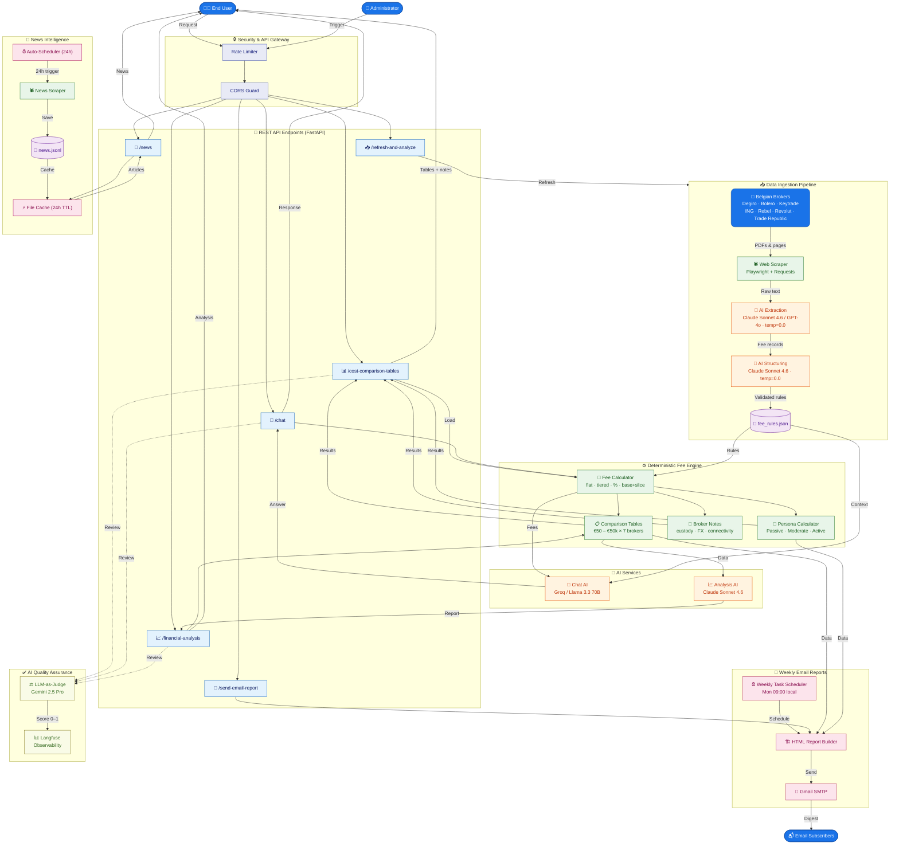

# be-invest — Business Flow Diagram

> **Audience:** Business stakeholders
> **Purpose:** End-to-end view of how data flows through the platform, from broker source data to user-facing outputs.

---

---

## Flow Summary

| Flow | Trigger | Key Steps | Output |
|------|---------|-----------|--------|
| **A · Fee Refresh** | Admin runs `/refresh-and-analyze` | Scrape PDFs → Claude/GPT-4o extract → Claude structure → Save | Updated `fee_rules.json` |
| **B · Fee Comparison** | User requests `/cost-comparison-tables` | Load rules → Compute fees → Build tables + notes | Fee matrix + TCO rankings |
| **C · AI Chat** | User posts question to `/chat` | Parse intent → Pre-compute fees → Groq/Llama answer | Natural language response |
| **D · Financial Analysis** | User calls `/financial-analysis` | Load tables → Claude narrative → Return report | Written analysis |
| **E · News Feed** | User calls `/news` | Check 24h cache → Serve recent articles | Broker news items |
| **F · Weekly Email** | Monday scheduler or `/send-email-report` | Build HTML → Gmail SMTP → Deliver | Subscriber email digest |
| **G · Quality Check** | Runs in background after every AI response | Gemini Judge reviews output → Score logged | Groundedness score in Langfuse |

---

## Key Design Principles

- **Deterministic-first:** Fees are computed by pure Python rules (no AI guessing) — AI is only used for extraction, structuring, and natural language output.
- **AI-as-a-Tool:** Separate LLMs handle different jobs: Claude/GPT-4o for extraction, Claude for structuring and analysis, Groq/Llama for chat speed.
- **Continuous Quality:** Every AI-generated response is independently scored by a fourth model (Gemini Judge) and logged to Langfuse.
- **Scheduled Automation:** News scraping is API-managed; weekly email should run through the standalone scheduler script so host sleep/restart behavior is explicit.
- **Security by default:** All requests pass through rate limiting and IP blocking before reaching any business logic.
